# Automate Project Information
In this section we will be using CodeFactory to get information about a project hosted in a Visul Studio solution and displaying it.
This guidiance is expected to accomplish the following.

 - How to format a CodeFactory command
 - How to consume data from the CodeFactory Framework
 - How to create a user interface and display data from CodeFactory

## Assumptions
It is assumsed you have completed the guidance Creating a Project. If you have not done that yet please click the link below and complete the first part before continuing. 

[Creating A Project](CreateProject.md)


## Goals
In this section we are going to create a project command that will display information about the project itself. 
The following information will be displayed about the project itself.

- Project Name
- Number of project files
- Number of project references

## CodeFactory Command Information
CodeFactory commands are raised directly by Visual Studio through the CodeFactory Framework. 

### Command Title
All CodeFactory commands have a title that is displayed in Visual Studio context menus. The field commandTitle that is hosted in the target command class is where the title for the command is set.

### Command Description
All CodeFactory commands have a description that is used on summary screens to explain what the command is for. The field commandDescription this is hosted in the target command class is where the description is set. 

### Enable Command
Every command has an over ride for the method EnableCommandAsync and it provides the Datamodel for the target solution explorer element it represents.
The CodeFactory framework calls this method to determine if this command should be displayed to the user in Visual Studio. 
There are times that command should not be displayed. 
For example If we want to add missing members to a class. 
If no members are missing we would not show the command.
With this in mind, the enable command allows you to use the data in the data model to determine if a command should be enabled for usage. 

The return from this method is true or false. If set to true the command will be displayed on the context menu.
If set to false it will not show up on the context menu and no further execution will be performed.

### Execute Command
Once a command has been enabled and the user selected the command from the context menu, CodeFactory will execute the command. 
CodeFactory will call the Overridden ExecuteCommandAsync implemented in your command class. Like with the enable command it will provide the current data for the target solution explorer element. 
This is where CodeFactory will execute your custom automation. 

# Command Implementation 
In this section we will implement all the logic that will display the project information. 
This has been broken down in to sub sections to provide greater clarification of each set of steps. 

## Format the Command
Before we begin the automation logic we need to format the command so it is ready for usage by staff. 
The following steps will be taken to format the command.

### Update the Command Title and Description
First we need to set the title and the description of the command so they display correctly in Visual Studio.

The following steps will be performed in the ProjectInformationCommand.cs code file.

1. We update the command title to Show Project Information. 

From:
```
private static readonly string commandTitle = "Replace with command title to be displayed in context menu";
```

To:
``` 
private static readonly string commandTitle = "Show Project Information";
```
___
2. We update the command description to Displays basic information about the project.

From:
```
private static readonly string commandDescription = "Replace with description of what this command does";
```

To:
```
private static readonly string commandDescription = "Displays basic information about the project";
```
____
3. Once updated should look like this.

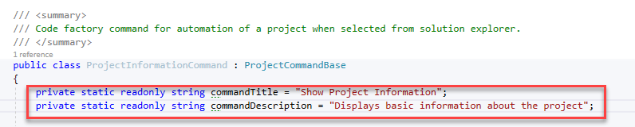
___

### Setup then Enable Command
Since we are displaying information about a project there are no extended conditions to validate we will just make sure we received a loaded data model from CodeFactory. 

1. CodeFactory already gives us a fully templated out method. So we will replace the to do with our enable logic. The provided method is shown below.


___
2. We will replace the TODO line with a check to make sure the data model loaded.
When a data model is loaded is has a property to determine if the data model was loaded or if it could not be loaded due to errors.
By default the method has a isEnabled variable aready created so we will check to the model is loaded and set isEnabled based on if the model is loaded.

From:
```
//TODO: Add logic to determine if this command is enabled.
```

To:
```
isEnabled = result.IsLoaded;
```
___
3. One the code updates are completed should look like this.


___
### Testing the Formatted Command
Before we dive into the logic lets go ahead and test to make sure our command formatting is correct. So we are going to debug our automation we have created so far. 

1. Click Start Debugging this will be the play button icon on your tool bar with star next to it.

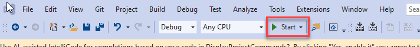

You will notice that will start a new instance of Visual Studio. 
This is by design CodeFactory automation runs inside of Visual Studio so we debug it from another instance.
___

2. From the What would you like to do? window click Create a new project


Or you can start the same process if you dont use the start up window. 
 - Click the File menu
 - From the context menu select New
 - From the sub context menu select Project

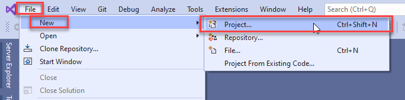
___
3. From the Create a new project dialog do the following.

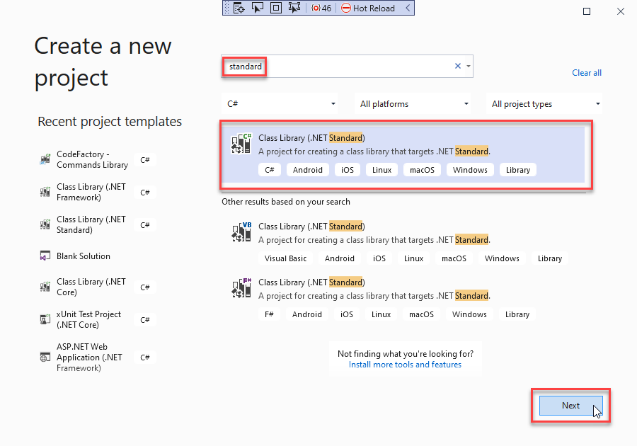

 - In the search box type standard
 - Select C# Class Library (.NET Standard)
 - Click the Next button
___
4. From the Configure your new project dialog do the following.

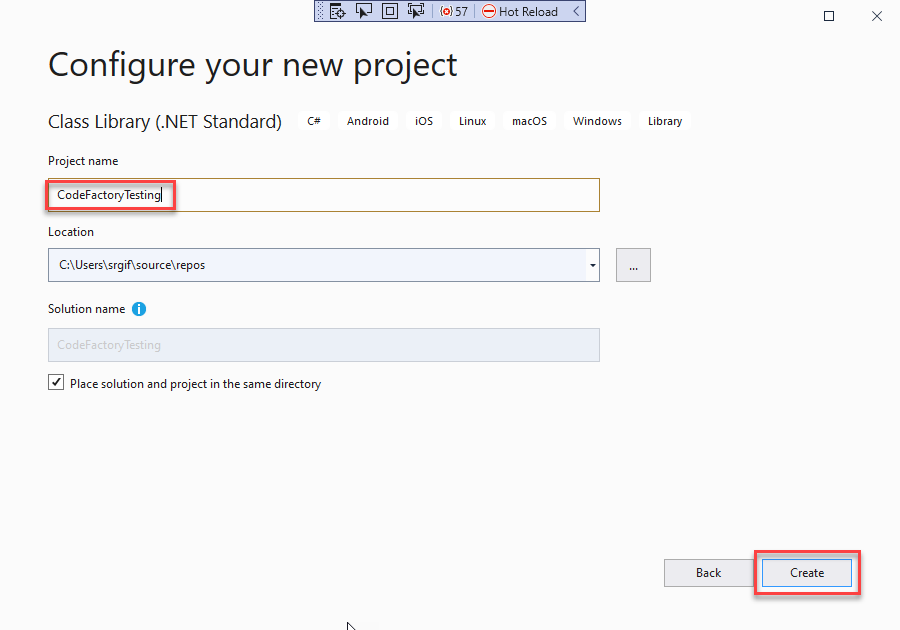

 - In the Project name text box enter CodeFactoryTesting
 - Click Create button
___
5. Once the project and solution have been created they will load. 
We will reuse this project and solution for all further testing as we complete the automation for this project.
To test the CodeFactory command we do the following.

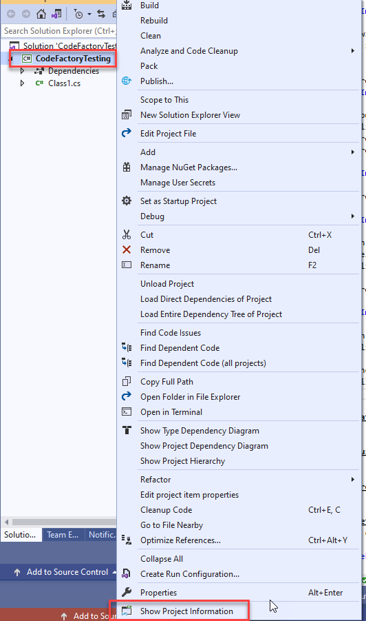

- Right click on the Project node in solution explorer
- From the context menu at the bottom you will see the Show Project Information command.
- Testing complete we know the command is running.
- Close the debugger instance of Visual Studio
___

## Gather Project Information
Now that the project command has been formatted we are ready to begin the automation logic. 
We need to get the following information and prepair it to be displayed to the user.

 - Project Name - The name of the project itself
 - Number of References - The count of how many references are tied to this project
 - Number of files - The number of files that are hosted in this project.

This logic will be hosted directly in the execute command. 
This gets called by the CodeFactory framework as soon as the command is selected from the context menu by a developer using our automation.

When we created the project command class it automatically added the ExecuteCommandAsync method. Which looks like this.

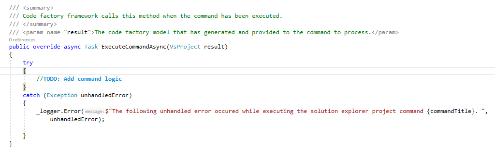

The following steps will be taken to add the project information logic to the ExecuteCommandAsync Method.

1. We will replace the TODO block with a bounds check to make sure we got a project model that was loaded.
If the model is not loaded will use a Messagebox to display a message explaining what happened.
From:
```
//TODO: Add command logic
```
To:
```
if (!result.IsLoaded)
{
    MessageBox.Show("Could not access the project information. Cannot display the project information",
    "No Model Data", MessageBoxButton.OK, MessageBoxImage.Exclamation);
    return;
}
```
Updated code will look like this.
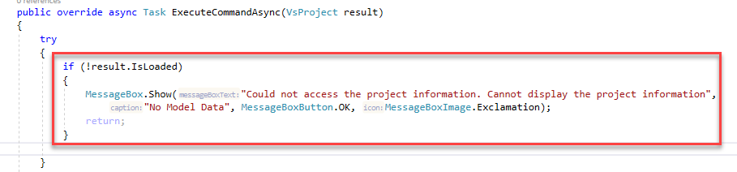
___
2. After our bounds check we will add the three variables that will be used to store the project information to be displayed.

```
string projectName = null;
int projectReferences = 0;
int projectFiles = 0;
```
Updated code will look like this.
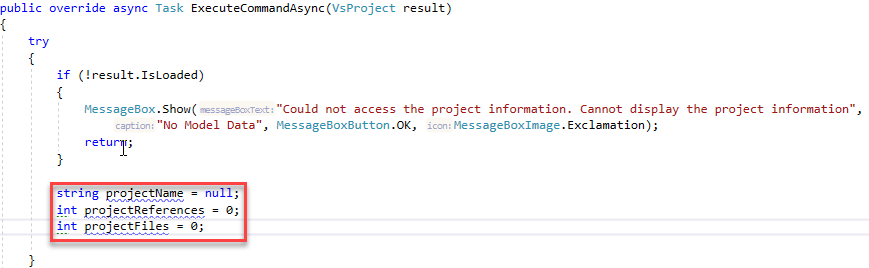 
___
3. Will capture the project name from the returned data model by entering the following.

```
projectName = result.Name;
```
Updated code will look like this.
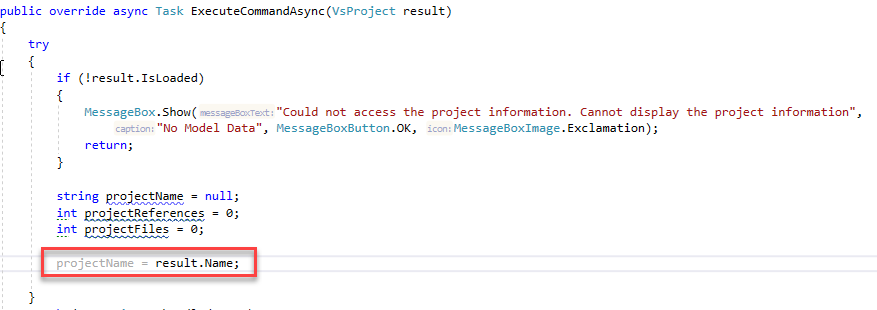
___
4. Next we will need to get the project references that are assigned to the project. 
This is done through a CodeFactory API call. Most CodeFactory API calls that talk to Visual Studio are done using an async call. 
This improves Visual Studio performance by running the tasks in the background when possible.
We get the references and add them to a var parameter to hold the references. 
Then we will get the count of all references and add it to our projectReferences variable.

```
var references = await result.GetProjectReferencesAsync();
projectReferences = references.Count;
```
Updated code will look like this.
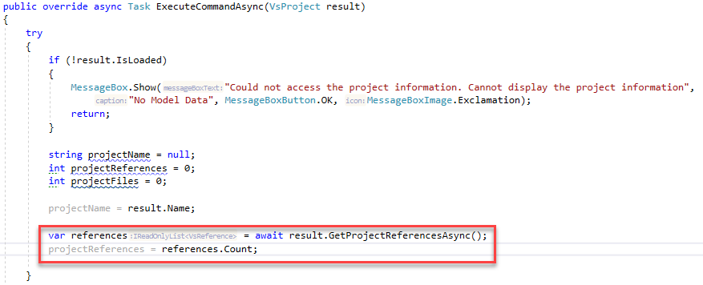
___
5. The final data needed from the project is the number of files that are hosted by the project.
Like with project references we need to make a CodeFactory API to get the real time data for each file and folder that hosted in the project.
This API call can access just the project root level or access all nested levels under folders. 
We are going to tell it to get all nested levels.

Since there are multiple different data models that represent Visual Studio data. 
The data that is returned as an inherited data type of all Visual Studio data called a VsModel. 
The inherited base class tells you what type of model is being represented.
You can then cast the model to the target type and use it.

A call is made to get all children of the project and stored in a var named projectChildren.
Then using a where clause on the projectChildren we select all models that are a document and store it in a var named files.
Finally we set our projectFiles variable with the count of the found files.

```
var projectChildren = await result.GetChildrenAsync(true);
var files = projectChildren.Where(m => m.ModelType == VisualStudioModelType.Document);
projectFiles = files.Count();
```
Updated code will look like this.
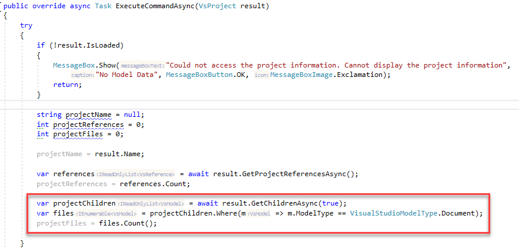
___
## Build Visual Studio Dialog
Now that we have the project data that we need, we will then focus on building a dialog to display this information in Visual Studio.

1. From solution explorer we are going to do the following.


 - Right click on the Dialog folder under the project folder
 - From the context menu select Add
 - From the sub context menu select New Item...
___ 
2. From the Add New Item dialog do the following

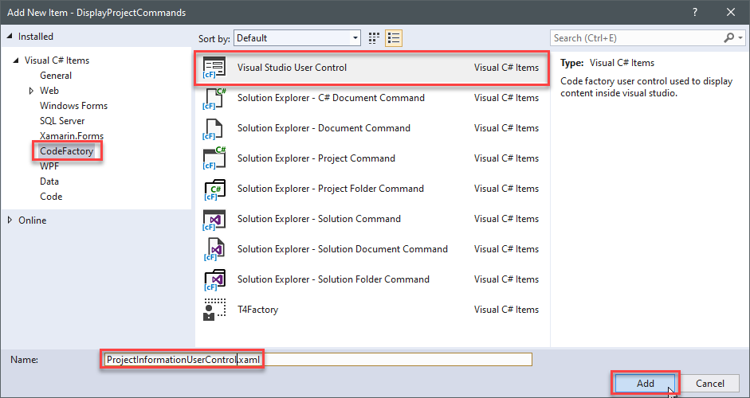

 - Under Visual C# Items select CodeFactory
 - Select Visual Studio User Control
 - In the name field enter ProjectInformationUserControl.xaml
 - Click Add
___
3. Now that the user control has been created it will open the user control xaml file. 
You will see the default markup for the user control itself. 
It will look like this.

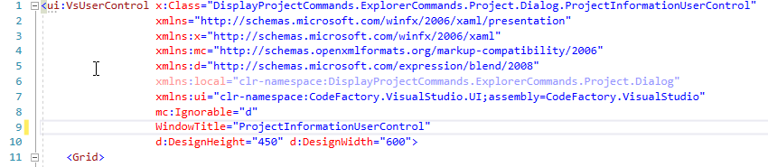
___
4. We are going to set the window title and set the target size of the dialog. 
We do this by updating the market up for the window title.
We also replace the Design height and width. 
We set the height to 175 pixels and the width to 400 pixels.

```
WindowTitle="Project Information"
Height="175"
Width="400">
```
The updated markup will look like this.
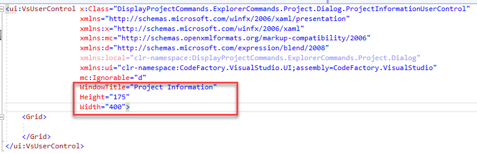
___
5. After we have setup our dialog and given it a title we are going to use a grid layout to format the placement of our data.
Since we are working with 3 elements of data we will create a grid with 5 rows and a total 3 columns. 

```
<Grid.ColumnDefinitions>
    <ColumnDefinition Width="20"/>
    <ColumnDefinition Width="150"/>
    <ColumnDefinition/>
</Grid.ColumnDefinitions>
<Grid.RowDefinitions>
    <RowDefinition Height="20"/>
    <RowDefinition Height="30"/>
    <RowDefinition Height="30"/>
    <RowDefinition Height="30"/>
    <RowDefinition />
</Grid.RowDefinitions>
```
The updated markup will look like this.

___
6. Once the layout has been setup we will add label and text box controls for each piece of project data that is being added to the project.

```
<Label Name="LabelProjectName" Grid.Row="1" Grid.Column="1" Content="Project Name:" HorizontalAlignment="Right" Margin="0,0,5,0"/>
<TextBox Name="TextBoxProjectName" Grid.Row="1" Grid.Column="2" Margin="5" IsEnabled="False"/>
<Label Name="LabelProjectReferences" Grid.Row="2" Grid.Column="1" Content="Project Reference Count:" HorizontalAlignment="Right" Margin="0,0,5,0"/>
<TextBox Name="TextBoxProjectReferences" Grid.Row="2" Grid.Column="2" Margin="5" Width="40" HorizontalAlignment="Left" IsEnabled="False"/>
<Label Name="LabelProjectFiles" Grid.Row="3" Grid.Column="1" Content="Project File Count:" HorizontalAlignment="Right" Margin="0,0,5,0"/>
<TextBox Name="TextBoxProjectFiles" Grid.Row="3" Grid.Column="2" Margin="5" Width="40" HorizontalAlignment="Left" IsEnabled="False"/>
```
The updated markup will look like this.

___
7. Next we wire up the button and register a method to handle the click event. 
```
<Button Name="ButtonOk" Grid.Row="4" Grid.Column="0" Grid.ColumnSpan="3" Margin="125,15" Content="Ok" Click="ButtonOk_OnClick"/>
```
Note in the IDE when you enter the click attribute it will prompt you to create a new method let it create the method for you.

The updated markup will look like this.

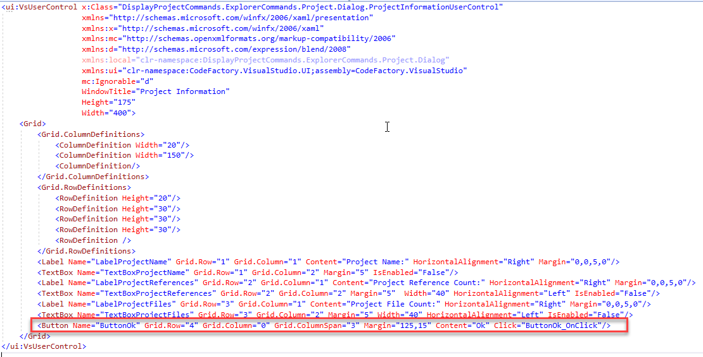

The final layout of the user control will look like this.

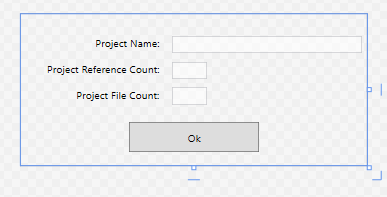
___
8. Now that the layout is complete we will access the code behind file for the user control and make some changes. 
To do this do the following.


 - Click the expander next to the xaml document of the user control it self.
 - Select the project file with the same name of the user control ending in .cs
 - This will will open the code file for edit.
___
9. After the code behind file has been opened we are going update the ok button click event method to close the dialog itself. 
Those familar with WPF will know there is no close method for a user control. 
This close event is part of the CodeFactory framework and will inform Visual Studio to close the dialog window. 
The following code will be added to close the dialog when clicked.

Before:
```
throw new NotImplementedException();
```

After:
```
this.Close();
```

The updated source code will look like this.

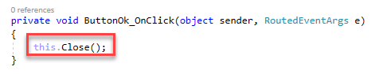
___
10. The final thing that is needed on the dialog is to be able to pass the project data to the user control.
We will create a public facing method that will take in the three pieces of information and directly set each control individually.

Those that are familar with WPF would probably used dependency properties. 
For this example we are keeping it simple for people that are not familar with WPF.

The following method is added to the code behind to set the data.
```
/// <summary>
/// Sets the project information to be displayed in the dialog
/// </summary>
/// <param name="projectName">The name of the project hosted in the solution.</param>
/// <param name="fileCount">The number of files hosted in the project.</param>
/// <param name="referenceCount">The number of references in the project.</param>
public void SetProjectInformation(string projectName, int fileCount, int referenceCount)
{
    this.TextBoxProjectName.Text = projectName;
    this.TextBoxProjectFiles.Text = fileCount.ToString();
    this.TextBoxProjectReferences.Text = referenceCount.ToString();
}

``` 
___
## Create and Display Dialog
Once we have created a dialog and formatted it. Next we will need to create an instance of the dialog user control. 
Then pass the data that has been collected on the project and display it. 

1. We navigate back to the ProjectInformationCommand code file. 
In the ExecuteCommandAsync method we are going to create an instance of the user control.

When working with the user interface we have to make a CodeFactory API call to make the instance of the user control.
Behind the covers CodeFactory wraps the defined user control in a WPF dialog window used by Visual Studio. 

In order to access the user interface you have to use a Visual Studio Action. 
All commands have direct access to all Visual Studio Actions managed by CodeFactory via a property on the command base class.

In the following we call ther user interface actions and create a instance of our user control and return it to the var dialog.

```
var dialog = await VisualStudioActions.UserInterfaceActions
                    .CreateVsUserControlAsync<ProjectInformationUserControl>();
```
The updated code looks like the following.

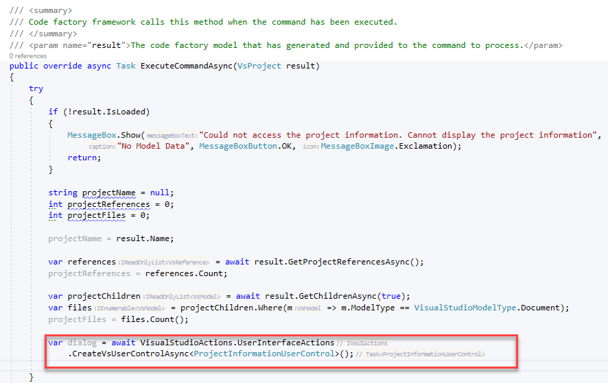
___
2. Once we have created an instance of dialog we will need to pass the project information to the dialog.
We will call the public method we created and pass our project data to the dialog. 

```
dialog.SetProjectInformation(projectName,projectFiles,projectReferences);
```
The updated code looks like the following.


___
3. Now that our data has been set we are ready to display the dialog itself. 
Once again we will make a CodeFactory API call and display the dialog in Visual Studio.

```
await VisualStudioActions.UserInterfaceActions.ShowDialogWindowAsync(dialog);
```
The updated code looks like the following.
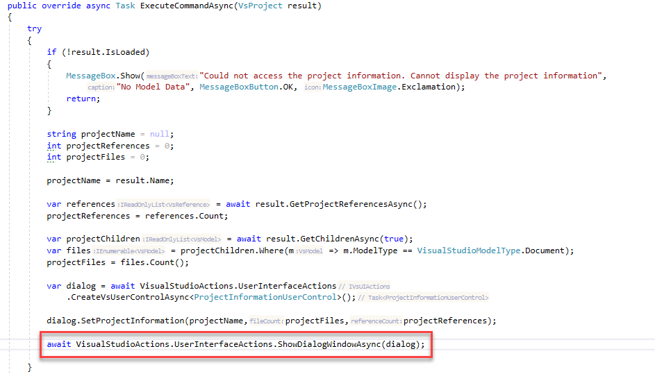
___

## Test Completed Command
Now the the project information command has been completed, we will use the debugger to test the logic.

1. Click Start Debugging this will be the play button icon on your tool bar with star next to it.


You will notice that will start a new instance of Visual Studio. 
This is by design CodeFactory automation runs inside of Visual Studio so we debug it from another instance.
___
2. One the debugger version of Visual Studio loads do the following.


 - Click File
 - From the menu select Recent Projects and Solutions
 - From the sub menu select CodeFactoryTesting.sln
 This will load our testing solution.

During the loading of the solution a number of services are loading. 
When in debugger mode this can be slow. 
You will know when your code factory logic is loaded by see this message in the lower left hand corner.


___
3. Next we execute the project information command and test our logic by doing the following.

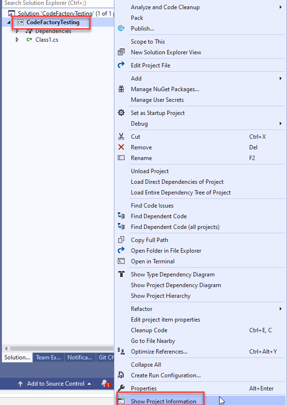

 - Right click on the project in the solution
 - From the context menu click Show Project Infomation

Visual Studio will then display the dialog with the information about the project.

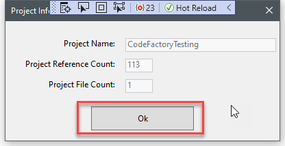

 - Click Ok to close the dialog 
___
4. Play with the project
Make changes to the project itself, add code files.
Maybe add a project reference and then rerun the command the dialog will show the updated information.

Since this is in debug mode, you can go back to the hosting copy of Visual Studio and set break points. 
You can then step through the code and see how everthing executes.

Once you are done close the debug version of Visual Studio.
___
## Deploying the Automation to Your Solutions
Every time you build your project the CodeFactory SDK calls an external executable called CFXPackager. 
This packages up your automation for using in solutions.

In the bin folder of your project is a file with the name of your project with a cfx file extension.


You copy the cfx file into the solution folder of your target solution you want to use with automation and CodeFactory will load it when the solution opens.


## Return to Guidance
This concludes the complete training for how to create a CodeFactory project. The link below will take you back to the guidance page.

[CodeFactory Guidance](../Overview.md)


## Return To Create Project Guidance 
The link below will take you back to the create project guidance.

[Create Project Guidance](Overview.md)


