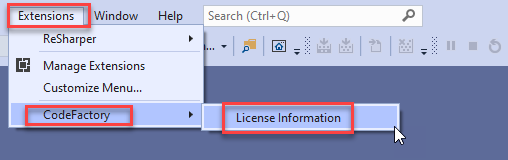

# CodeFactory Install from GitHub and License Setup
Use the following steps to install and license the **CodeFactory Runtime for  Visual Studio** extension.

## Step 1: Download the CodeFactory for Visual Studio Runtime
Get the latest release of the CodeFactory Runtime installer from GitHub [here](https://github.com/CodeFactoryLLC/CodeFactory/releases/latest).

## Step 2: Execute the VSIX Installer
Simply run the VSIX installer that was downloaded in Step 1 on the same machine that your copy of Visual Studio is already installed on. 
This will prompt to install to **Visual Studio 2022** editions you have installed on your machine.  

## Step 3: Get a License Key
CodeFactory license keys are free. You will need to register to get your license key.

Navigate to [CodeFactory License](https://license.codefactory.software) site.
Once you register a account it will display your license. 
Simply click the copy key button on the site. 

## Step 4: License Key Activation
Once the VSIX has installed CodeFactory Runtime, launch Visual Studio, and follow these steps to add your license key you registered from the **license.codefactory.software** website.

- From Visual Studio, click the Extensions menu, select CodeFactory > License Information

___
-  From the [cF] License Information screen, click “Activate License”

___
- Paste the license key you copied from the license screen. Once the license key is pasted/visible in the Enter License text box click “Activate License”.

 
___
- From the [cF] License Information screen you should now see your license information displayed.

Click “Close” and your CodeFactory license is now activated.
___

