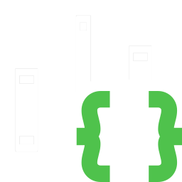

<a class="brand">
 
CodeFactory Platform
</a>

This site is dedicated to helping software developers learn and make the most of the platform. 

The following sections outline the information that can be found on this site.
___

<a class="brand" href="gettingstarted/intro.md" >
 
Getting Started
</a>

Getting started focuses on getting a new user up and running the **CodeFactory** platform as soon as possible. 
____

<a class="brand" href="guidance/intro.md">

Guidance
</a>

Guidance focuses on focused learning on how to use the various capabilities of **CodeFactory**.
___
<a class="brand" href="api/index.md">

Software Development Kit - (SDK)
</a>

Software development kit focuses on providing full API level documentation for **CodeFactory** by target platform. 
___

<a class="brand" href="releasenotes/intro.md">

Release Notes
</a>

Release notes provides information about changes to the **CodeFactory** runtimes and SDK's.
___

