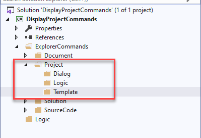

# Creating a Project
The first step will be to create a project and register our first command.

## Background
The following is important background information on CodeFactory itself. 
This will help you understand the default startup behavior the first time you create a CodeFactory project.

### NuGet
CodeFactory was designed to load the target versions of the SDK libraries directly from NuGet. 
The way that this is accomplished is by adding direct project references to the target version hosted on NuGet.
With the legacy project system used to host .Net framework it does not automatically pull down these NuGet packages when you load the project for the first time. 
So if any CodeFactory project items are added you will get a number of errors related to the libraries not being loaded. 
The NuGet packages will automatically be pulled down the first time you do a build (Ctrl-Shift-B) of the project itself, these errors will then go away.

### CodeFactory Packager
A CodeFactory commands project is the main execution point for all CodeFactory automation. 
This project will automatically execute a command line utility after the compile of the project has completed.
The CFXPackager utility is responsible for building the CFX file that is used to run CodeFactory automation. 

If no commands are defined in the project this utiltity will output a error saying the package could not be built. 
This error will go away once the first command is added to the project. 

 
## Walk-through Steps
Follow these steps to successfully create and compile your CodeFactory project:

1. Start Visual Studio
___
2. From the "What would you like to do?" window click "Create a new project".

Or you can start the same process if you dont use the start up window. 
 - Click the File menu
 - From the context menu select New
 - From the sub-context menu select Project

___
3. From the "Create a new project" window do the following:

 - In the search box type CodeFactory
 - From The list of projects select "CodeFactory - Commands Library"
 - Click "Next"
___ 
4. From the "Configure your new project" window do the following:

 - In the "project name" box type "DisplayProjectCommands"
 - Click Create
___ 
5. Once the solution and project has been created you will see the project and default folder structure. I have expanded the Project folder to show you the sub-folders. 

The following is a brief overview of the goal for each folder. 
Important note: each Explorer Command has its own folder. 
The following structure is prescriptive only. 
You can create any folder structure you wish for your automation.

 - The Project folder is where project commands are created and stored
 - The Dialog folder is for placement of user interface dialogs you created.
 - The Logic folder is where you add logic that can be reused across multiple project commands
 - The Template folder is where you add T4 template that are used by project commands. 
___
6. Next we will add a solution explorer project command to the project. Do the following steps:

 - Right click on the project folder in solution explorer
 - From the context menu select Add
 - From the sub context menu select New Item...
___ 
7. From the Add New Item Dialog Window do the following:

- From the Visual C# Items select CodeFactory
- Select Solution Explorer - Project Command
- In the name box enter ProjectInformationCommand.cs
- Then click Add
___
8. A Microsoft Visual Studio error box will appear. 

This error occurs because the CodeFactory SDK NuGet packages have not been downloaded into the project yet. 
This is normal. Click Ok to continue.
___
9. The command code file will display in the IDE and a number of syntax errors will appear. This is occuring since we have not pulled down the SDK through NuGet yet.

___
10. We will then Build the solution which will trigger the pull of the NuGet packages. Do the following:

 - From the top navigation bar click on Build
 - From the context menu click Build Solution
___ 
11. Once the build has completed it will have downloaded and installed the NuGet packages into the project. 

You will now see the CodeFactorySDK reference in the project. 

You will also notice there are no longer any errors in the project command.

The project creation is complete. 
___
## Next Step - Automating Project Information
In the next section we will build the logic to read information about a project and display it to the user in Visual Studio. 

[Automate Project Information](AutomateProjectInformation.md)

## Return To Create Project Guidance 
The link below will take you back to the create project guidance.

[Create Project Guidance](Overview.md)
