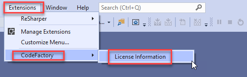

# CodeFactory Install and Setup
Use the following steps to install the CodeFactory Runtime Visual Studio Extension:

## Step 1: Download the CodeFactory for Visual Studio Runtime
Get the latest release of the CodeFactory Runtime installer from [here](https://github.com/CodeFactoryLLC/CodeFactory/releases/latest).

## Step 2: Execute the VSIX Installer
Simply run the VSIX installer that was downloaded in Step 1 on the same machine that your copy of Visual Studio is installed on.  

## Step 3: License Key Activation
Once the VSIX has installed CodeFactory Runtime, launch Visual Studio 2019, and follow these steps to add your license key (which was included in the email confirmation). 

- From Visual Studio 2019, click the Extensions menu, select CodeFactory > License Information

___
-  From the [cF] License Information screen, click “Activate License”

___
- Copy the license key that was included in your email receipt/confirmation and “Paste From Clipboard” as shown below. Once the license key is pasted/visible in the Enter License text box click “Activate License”.

 
___
- From the [cF] License Information screen you should now see your license information displayed.

Click “Close” and your CodeFactory license is now activated.
___

## Guidance
Once you have completed the setup of CodeFactory you can return to guidance here.

[CodeFactory Guidance](../Overview.md)
